# RealEyes: Comprehensive Software Architecture & Integration Document

RealEyes is a state-of-the-art deepfake and misinformation detection platform. It combines a Next.js (React) visual dashboard with a multi-model Python Flask backend containing advanced computer vision classifiers, anomaly segmenters, screenshot processors, and bilingual NLI (Natural Language Inference) web fact-checkers.

This document describes the software architecture, file structure, subsystem configurations, and integration contracts of the RealEyes workspace.

---

## 📁 System-Wide Directory Structure

All source code, models, and assets are consolidated under the root folder `D:\Downloads\final grad project\final web grad\`. Here is the complete file and folder mapping:

```
final web grad/
│
├── README.md                           # This architecture documentation
│
├── grad web/                           # NEXT.JS FRONTEND WEB APP
│   ├── public/                         # Public assets & site images
│   │   ├── WEB LOGO.png               # High-res site branding logo
│   │   ├── file.svg, next.svg, etc.   # Tailwind/Next starter assets
│   │   └── sw.js                       # Service worker configuration
│   ├── src/                            # React application source code
│   │   ├── app/
│   │   │   ├── globals.css            # Custom glassmorphic scrollbars & styling
│   │   │   ├── layout.tsx             # Root layout, HTML viewport, Google Fonts
│   │   │   ├── page.tsx               # Entry point
│   │   │   └── dashboard/             # Main Dashboard interface folder
│   │   │       └── page.tsx           # Dashboard view: Text, Image, Post, Video
│   │   ├── components/                # Reusable UI component libraries
│   │   │   └── ui/                    # Styling-focused components
│   │   │       ├── progress.tsx       # Dynamic linear progress bar
│   │   │       ├── tabs.tsx           # Custom animatable navigation triggers
│   │   │       ├── card.tsx           # Glass backdrop containers
│   │   │       └── ...                # Badge, Button, Input, Textarea, utils
│   │   └── lib/
│   │       └── utils.ts               # Tailwind CSS className merge helper
│   ├── package.json                    # Node.js dependencies & run scripts
│   ├── tsconfig.json                   # TypeScript project rules
│   └── tailwind.config.ts / postcss    # Tailwind styling rules
│
├── classification_model/               # BACKEND SERVER & CLASSIFIER
│   ├── server.py                       # Flask Entry Point, locks, API endpoints
│   ├── test_classification.py          # Swin-V2 model loader, predictor, and report card creator
│   ├── bestv_3.3.pth                   # Trained Swin-V2 forensic model weights (1.4GB)
│   ├── results/                        # Directory where report & heatmap outputs are saved
│   └── __pycache__/                    # Compiled Python bytecode cache
│
├── segmintation_model/                 # AXUNet ANOMALY SEGMENTER
│   ├── test_segmintation.py            # AXUNet predictor, mask extractor, and overlay renderer
│   └── checkpoint_epoch_21.pth         # Trained segmentation model weights
│
├── screenshout_handling/               # screenshot PARSING (POST MODE)
│   └── screenshot_server_ar.py         # Sub-region croppers & crop block extraction
│
└── gradprojectFullnewsPart/            # BILINGUAL WEB FACT-CHECKER (TEXT MODE)
    └── test_live_web4withoutgroq.py    # Search query translator, DuckDuckGo scraper, NLI classifier
```

---

## 💻 Subsystem Architectures

### 1. Frontend Web App (`grad web/`)
Built with **Next.js 16 (Turbopack)**, **React 19**, **TypeScript**, and styled using custom **Vanilla CSS** and **Tailwind CSS**. It follows a single-page app dashboard design optimized for heavy visual forensic analytics.

* **`/dashboard` ([page.tsx](file:///d:/Downloads/final%20grad%20project/final%20web%20grad/grad%20web/src/app/dashboard/page.tsx)):** Coordinates the four core detection systems via tabbed interfaces:
  * **Text Verification:** Users enter fact-checked claims. Runs asynchronous status checkers using polling.
  * **Image Forensic:** Users upload images. Integrates interactive selector modes: `"full"` (auto-analyzes and runs classification) or `"seg_only"` ("Detect the part", bypassing classifications to render anomaly maps).
  * **Post Analysis:** Processes screenshots of social-media posts. Sub-regions classified as fake show their segmentation maps inline with zoomable lightboxes.
  * **Video Verification:** Processes video files, uploading them in binary format.
* **UX Polish:** Implements micro-interactions, responsive sizing, animated modal lightboxes, and reactive connection check flags (`apiStatus` of `"connected"` vs `"demo"` fallback).

### 2. Backend Flask Server (`classification_model/`)
A Python Flask API server running on port `5001`. It handles concurrent GPU executions and caches structural weight models in RAM to guarantee low-latency inference.

* **Server Entry Point ([server.py](file:///d:/Downloads/final%20grad%20project/final%20web%20grad/classification_model/server.py)):**
  * Loads classification, segmentation, and translation models sequentially on CPU/GPU (`cuda`).
  * Enforces `threading.Lock` (`_infer_lock`, `_seg_infer_lock`) on CPU/GPU operations to prevent model corruption during simultaneous client requests.
  * Serves prediction metadata as JSON payloads and processed image layouts via path parameters.

* **Swin-V2 Forensic Classifier ([test_classification.py](file:///d:/Downloads/final%20grad%20project/final%20web%20grad/classification_model/test_classification.py)):**
  * Defines a multi-branch architecture: Swin-V2-Base core + Fast Fourier Transform (FFT) branch (frequency-domain anomaly detection) + Noise/Edge branches.
  * `make_report()`: Generates a high-resolution, pixel-perfect layout card. Places the scaled input photo on the left (with a dark bottom gradient vignette and verdict badge) and forensic stats on the right (Real/AI bar indicators).

### 3. Segmentation Subsystem (`segmintation_model/`)
* **AXUNet Network ([test_segmintation.py](file:///d:/Downloads/final%20grad%20project/final%20web%20grad/segmintation_model/test_segmintation.py)):**
  * Performs semantic segmentation to highlight specific regions of an image that have been edited, blended, or synthetic.
  * Takes input images, processes them into normalized tensors, and outputs a 2D confidence heatmap overlaying pixel discrepancies in HSL color maps (jet/blue-to-red).

### 4. Bilingual Fact-Checking Engine (`gradprojectFullnewsPart/`)
* **Live Search fact-checker ([test_live_web4withoutgroq.py](file:///d:/Downloads/final%20grad%20project/final%20web%20grad/gradprojectFullnewsPart/test_live_web4withoutgroq.py)):**
  * Runs bilingual NLP processing. Translates inputs (EN ↔ AR) to search both English and Arabic web indices.
  * Scrapes search results from DuckDuckGo, performs NLI (Natural Language Inference) checking against scraped pages, and aggregates source trust scores to return a final verdict: `"SUPPORTS"` (Verified), `"REFUTES"` (Misinformation), or `"NOT ENOUGH INFO"`.

---

## 🔗 Frontend-Backend Integration & Data Flow

```mermaid
sequenceDiagram
    participant FE as Next.js Frontend (Port 3000)
    participant BE as Flask Backend (Port 5001)
    participant CLF as Swin-V2 Classifier
    participant SEG as AXUNet Segmenter

    Note over FE,BE: Initialization: Frontend polls /health on mount to set status to Live vs Demo
    
    rect rgb(30, 41, 59)
    Note over FE,SEG: Image Tab (Full Analysis Mode)
    FE->>BE: POST /predict { imageUrl: "data:image...", forceSeg: false }
    BE->>CLF: predict_class(image)
    CLF-->>BE: pred=0 (REAL), probs=[0.92, 0.08]
    Note over BE: Since REAL probability > 15%, segmentation is skipped.
    BE->>BE: make_report() (Generates report image)
    BE-->>FE: JSON { ok: true, label: "REAL", pred: 0, probs: [...], out_path: "results/..." }
    Note over FE: Renders green verdict badge, green "Authenticity Score: 92%" bar, and report image
    end

    rect rgb(51, 65, 85)
    Note over FE,SEG: Image Tab (Detect the Part Mode)
    FE->>BE: POST /predict { imageUrl: "data:image...", forceSeg: true }
    BE->>CLF: predict_class(image)
    CLF-->>BE: pred=1 (FAKE), probs=[0.06, 0.94]
    Note over BE: Since forceSeg is true, run AXUNet segmenter
    BE->>SEG: predict_mask(image)
    SEG-->>BE: anomaly mask tensor
    BE->>BE: save_heatmap_card() (Generates heatmap image)
    BE-->>FE: JSON { ok: true, label: "FAKE", ..., seg_path: "results/..." }
    Note over FE: Recognizes 'Detect the part' mode: hides classification badges/bars and displays only the Heatmap
    end
```



---

## 🔌 API Contract Reference

### 1. Backend Service Status
* **Endpoint:** `GET /health`
* **Response:**
  ```json
  { "ok": true }
  ```
* **Frontend Usage:** Verified inside an asynchronous `useEffect` hook on dashboard mount. Sets `apiStatus` to `"connected"`. If it fails (throwing a CORS/network exception), the UI gracefully transitions to `"demo"` fallback mode.

### 2. Image Predictions
* **Endpoint:** `POST /predict`
* **Request Body:**
  ```json
  {
    "imageUrl": "data:image/png;base64,...",
    "forceSeg": true
  }
  ```
* **Response:**
  ```json
  {
    "ok": true,
    "label": "REAL", 
    "pred": 0,
    "probs": [0.9226, 0.0774],
    "out_path": "results/realeyes_9xplhfax_report.png",
    "seg_path": "results/realeyes_9xplhfax_segmentation.png"
  }
  ```
* **Frontend Logic mapping ([page.tsx:L175-179](file:///d:/Downloads/final%20grad%20project/final%20web%20grad/grad%20web/src/app/dashboard/page.tsx#L175-L179)):**
  * If `data.label` is `"FAKE"` or `data.pred === 1`, frontend sets `verdict` to `"AI Generated"`. Displays `"AI Probability"` progress bar (purple).
  * If `data.label` is `"REAL"` or `data.pred === 0`, frontend sets `verdict` to `"Authentic Image"`. Displays `"Authenticity Score"` progress bar (green).
  * In `"seg_only"` mode, the classification badge, progress bar, and view switcher toggles are hidden; the visualizer is forced to render the `seg_path` image directly.

### 3. Static Report Assets Server
* **Endpoint:** `GET /report?path=<filepath>`
* **Parameters:** `path` represents the relative path returned from the predictions (`out_path` or `seg_path`).
* **Response:** Streamed binary PNG image file.
* **Frontend Usage:** Serves the report images to the viewer container and handles the lightbox fullscreen modal zoom.

### 4. Text Verification (Asynchronous Polling)
* **Endpoint 1:** `POST /verify-text-start`
* **Request Body:** `{ "text": "Claim to check..." }`
* **Response:** `{ "no_claim": false, "task_id": "b222603..." }`
* **Endpoint 2:** `GET /verify-progress/<task_id>`
* **Response:**
  ```json
  {
    "done": true,
    "result": {
      "final_prediction": "REFUTES",
      "confidence": 0.85,
      "explanation": "Claim contradicted by Snopes.",
      "evidence": [{ "title": "Reference URL", "url": "https://..." }]
    }
  }
  ```
* **Frontend Logic mapping ([page.tsx:L80-117](file:///d:/Downloads/final%20grad%20project/final%20web%20grad/grad%20web/src/app/dashboard/page.tsx#L80-L117)):**
  * Triggers a `setInterval` checking status every 2 seconds. When `done === true`, clears the interval, handles NLI predictions to set classification verdicts (`"Verified"`, `"Misinformation"`, or `"Not Enough Info"`), and displays linked reference sources.

### 5. Post Social Media Screenshots
* **Endpoint:** `POST /process-screenshot`
* **Request Body:** `{ "dataUrl": "data:image/png;base64,..." }`
* **Response:**
  ```json
  {
    "ok": true,
    "regions": [
      {
        "id": 1,
        "type": "image block",
        "label": "FAKE",
        "probs": [0.06, 0.94],
        "out_path": "results/...",
        "seg_path": "results/..."
      }
    ],
    "text_results": [...]
  }
  ```
* **Frontend Logic mapping ([page.tsx:L220-265](file:///d:/Downloads/final%20grad%20project/final%20web%20grad/grad%20web/src/app/dashboard/page.tsx#L220-L265)):**
  * Iterates through sub-regions. If a sub-image contains `"fake"` or `"ai"` labels, the dashboard displays its anomaly segmentation map inline inside the Social Post feed view.

### 6. Video Deepfake Analyzer
* **Endpoint:** `POST /classify-video` (Form Data upload)
* **Request Body:** Binary `.mp4` / `.mov` payload parameter named `video`.
* **Response:** `{ "ok": true, "probs": [0.05, 0.95], "explanation": "Inconsistencies detected..." }`
* **Frontend Logic mapping ([page.tsx:L330-340](file:///d:/Downloads/final%20grad%20project/final%20web%20grad/grad%20web/src/app/dashboard/page.tsx#L330-L340)):**
  * Displays verdict badge `"Deepfake Detected"` or `"Verified Video"` and sets confidence score to `probs[1]` or `probs[0]` respectively.

---

## 🔄 Step-by-Step System Execution Flow

Here is the exact step-by-step path a request takes when using the RealEyes platform:

1. **User Action:**
   * The user opens the dashboard and selects a tab (Text, Image, Post, or Video).
   * They upload their media or enter text.
   * If in the **Image tab**, they choose a mode: **Full Analysis (Auto)** (for classification + optional heatmap) or **Detect the part** (for direct heatmap generation).
   * They click the action button (e.g., `"Generate Heatmap"` or `"Analyze Image"`).

2. **Frontend Dispatch:**
   * The Next.js client encodes the uploaded file into a base64 data URL (or matches raw text/binary form data).
   * It sends a `POST` request to the Flask server (`http://127.0.0.1:5001`) at the corresponding endpoint (e.g., `/predict` or `/process-screenshot`).

3. **Backend Receiver & Inference Lock:**
   * The Flask server receives the HTTP request payload.
   * It activates a thread lock (`_infer_lock` or `_seg_infer_lock`) to make sure that concurrent client scans do not corrupt the PyTorch active memory parameters.

4. **Neural Network Processing:**
   * **Image Classification:** The image is passed to the **Swin-V2 Forensic** model. The model outputs a prediction index (`0` for Real, `1` for Fake) and prediction probabilities.
   * **Segmentation Overlay (if triggered):**
     * *Trigger conditions:* The user manually requested `"Detect the part"`, OR they requested `"Full Analysis"` and the Swin-V2 classification confidence of the image being Real is below `85%`.
     * The image is converted into normalized tensors and evaluated by the **AXUNet Anomaly Segmenter** to calculate pixel-level manipulations.
   * **Report Card Generation:** 
     * The backend runs PIL-drawing overlays to generate a final report card (`results/*_report.png`) displaying verdict stats, or a color-coded anomaly mask (`results/*_segmentation.png`).

5. **JSON Response Dispatch:**
   * The Flask server releases the thread lock and returns a HTTP `200` JSON response containing the prediction classifications (`REAL`/`FAKE`), confidence arrays, and paths to the generated images inside the `/results` folder.

6. **Frontend State Update & UI Render:**
   * The Next.js client parses the JSON response.
    * It dynamically adjusts its state:
      * Sets verdict states and updates progress bars (green for Authentic, purple/red for AI-Generated).
      * If the user selected **"Detect the part"**, the UI automatically hides classification statistics, badges, and view-switch tabs, rendering the anomaly heatmap image directly.
    * Enables zoom overlay lightboxes when the result card is clicked.

---

## 🛠️ How to Set Up and Run the Platform

Follow these steps to configure your environment and run the backend and frontend subsystems locally.

### 📋 Prerequisites
Ensure you have the following installed on your operating system (tested on Windows 10/11):
1. **Node.js (v18.x or newer)** — for the frontend Next.js server.
2. **Python (v3.10.x to v3.12.x)** — for the backend Flask server and AI inference.
3. **NVIDIA CUDA Toolkit (Optional)** — if using GPU acceleration for models (strongly recommended; otherwise, it will fall back to CPU mode).

---

### 🐍 Step 1: Run the Backend Flask Server

1. Open your terminal (e.g., PowerShell or Command Prompt).
2. Navigate to the `classification_model` folder:
   ```bash
   cd "D:\Downloads\final grad project\final web grad\classification_model"
   ```
3. Set the terminal encoding override (this prevents Python encoding crashes when printing unicode loaded indicators `✓`):
   * **On Windows (PowerShell):**
     ```powershell
     $env:PYTHONIOENCODING="utf-8"
     ```
   * **On Mac / Linux / Git Bash:**
     ```bash
     export PYTHONIOENCODING=utf-8
     ```
4. Start the server using Python:
   ```bash
   python server.py
   ```
   *The server will load the checkpoints, compile weights onto the CUDA/CPU device, and bind to **`http://127.0.0.1:5001`**.*

---

### 🌐 Step 2: Run the Frontend Web App

1. Open a new terminal tab or window.
2. Navigate to the `grad web` folder:
   ```bash
   cd "D:\Downloads\final grad project\final web grad\grad web"
   ```
3. Boot the Next.js development server:
   ```bash
   npm run dev
   ```
    *The dashboard will connect to the backend server automatically, switching the connection indicator status to `"connected"`.*

---

## 🐙 GitHub Repository & Directory Exclusions

The project utilizes Git to manage deployment repositories, separating source code files from heavy binaries to stay within cloud host quotas.

### 🟢 What is Tracked on GitHub ([grad-_web](https://github.com/Eyad-Elnakib/grad-_web.git))
The GitHub repository is initialized specifically inside the **`grad web/`** folder to track the Next.js frontend application. The tracked items include:
* **UI Code & Layout Modules:** All React elements, custom CSS variables, and layout pages (`src/app/*`).
* **Visual Configurations:** Site branding logos, icons, and service workers (`public/*`).
* **Metadata & Scripts:** Package locks, Node dependencies, and project options (`package.json`, `tsconfig.json`, `components.json`).

### 🔴 What is Excluded (Not Tracked)
Certain directories are omitted from GitHub to keep commits lightweight and bypass hosting size constraints:
1. **Model Weights & Checkpoints (Too Large):**
   * *Weights excluded:* `bestv_3.3.pth` (1.4GB) and `checkpoint_epoch_21.pth`.
   * *Reason:* GitHub enforces a strict **100MB file limit**. High-dimensional neural network weights must be maintained locally or pulled from separate model storage servers.
2. **Sub-folders Outside the Git Scope:**
   * The Python backend modules (`classification_model/`, `segmintation_model/`, `screenshout_handling/`, `gradprojectFullnewsPart/`) and the root-level documentation are not tracked in the `grad-_web` repository, as Git is initialized inside the `grad web` folder.
3. **Local Cache & Compiled Directories (Ignored):**
   * `node_modules/` (restored locally via `npm install`).
   * `.next/` (regenerated on build/start).
   * `tsconfig.tsbuildinfo` (TypeScript incremental compilation outputs).

